# Analyzed Series - debt-persector

This file is auto-managed by append_series_to_markdown_overview().

| Series_ID | Description | Interval Covered | Frequency | Missing Values Summary | Suggested TCode 1 | Suggested TCode 2 | Level Plot | TCode 1 Plot | TCode 2 Plot |
| --- | --- | --- | --- | --- | --- | --- | --- | --- | --- |
| FGSDODNS | 
Federal Government; Debt Securities and Loans; Liability, Level - per sector of TCMDO Caveats: - t5 or t6 again, t5 with mean, big peak though - same tcode for all per sector
 | 1945-10-01 -> 2025-07-01 | Quarterly, End of Period Seasonally Adjusted Annual Rate | n_missing=18; share=5.62%; intervals=1946-01-01->1946-07-01 (3), 1947-01-01->1947-07-01 (3), 1948-01-01->1948-07-01 (3), 1949-01-01->1949-07-01 (3), 1950-01-01->1950-07-01 (3); +1 more | 5 | 6 | 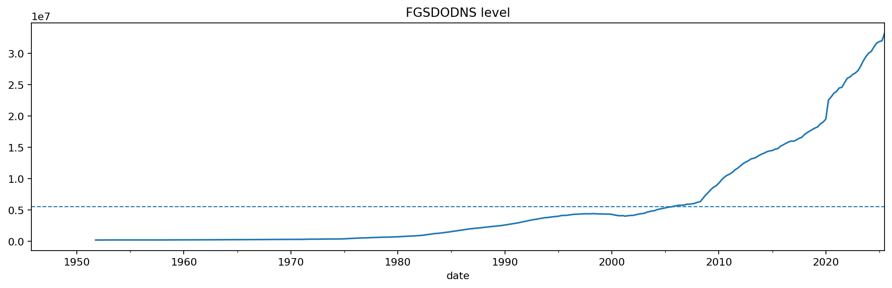 | 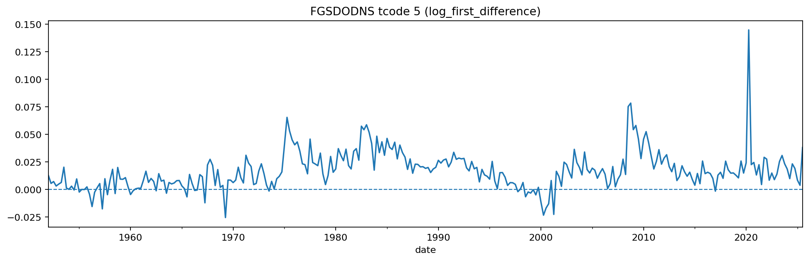 | 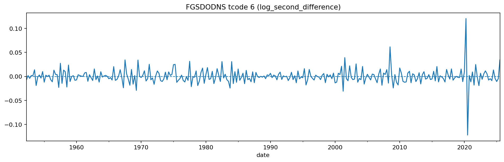 |
| NCBDBIQ027S | 
Nonfinancial Corporate Business; Debt Securities; Liability, Level - per sector of TCMDO Caveats: - t5 or t6 again - same tcode for all per sector
 | 1945-10-01 -> 2025-07-01 | Quarterly, End of Period Not Seasonally Adjusted | n_missing=18; share=5.62%; intervals=1946-01-01->1946-07-01 (3), 1947-01-01->1947-07-01 (3), 1948-01-01->1948-07-01 (3), 1949-01-01->1949-07-01 (3), 1950-01-01->1950-07-01 (3); +1 more | 5 | 6 | 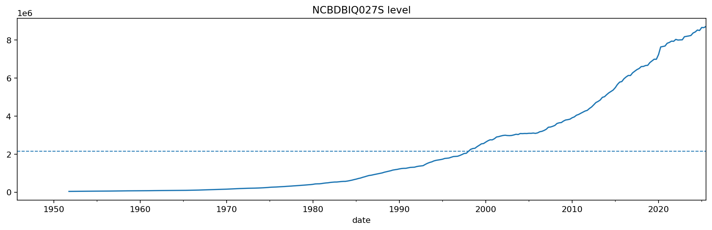 | 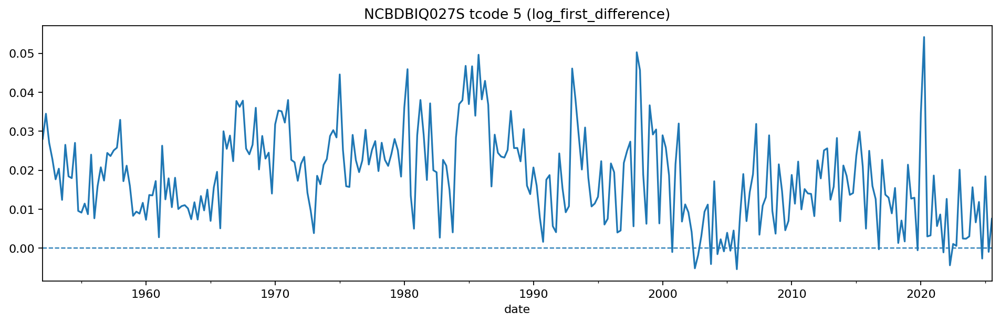 | 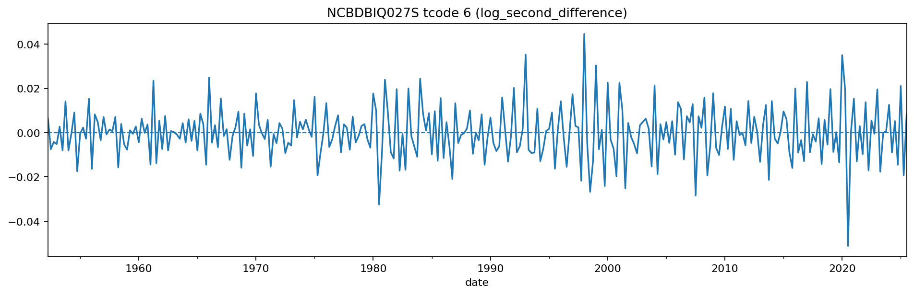 |
| SBDDSA | 
Security Brokers and Dealers; Debt Securities; Asset, Level - per sector of TCMDO Caveats: - t5 or t6 again - I THINK ONE CAN SEE REGULATION OF SECURITY BROKES AS HOW MUCH DEBT THEY CAN OWN - same tcode for all per sector
 | 1945-10-01 -> 2025-07-01 | Quarterly, End of Period Not Seasonally Adjusted | n_missing=18; share=5.62%; intervals=1946-01-01->1946-07-01 (3), 1947-01-01->1947-07-01 (3), 1948-01-01->1948-07-01 (3), 1949-01-01->1949-07-01 (3), 1950-01-01->1950-07-01 (3); +1 more | 5 | 6 | 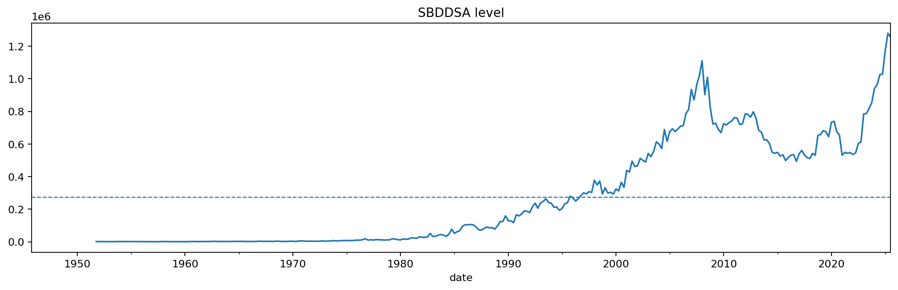 | 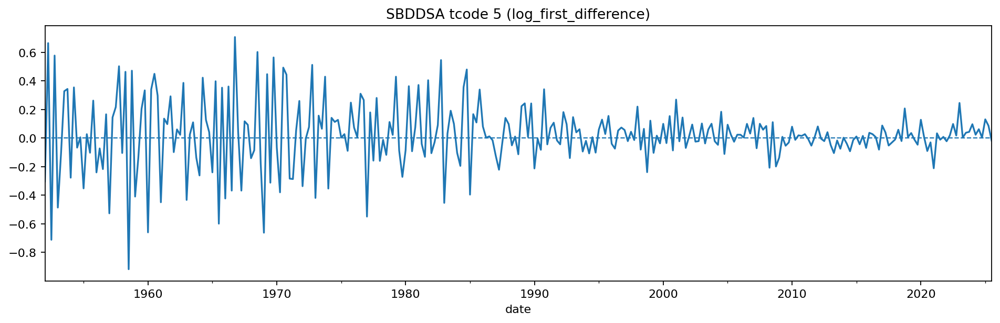 | 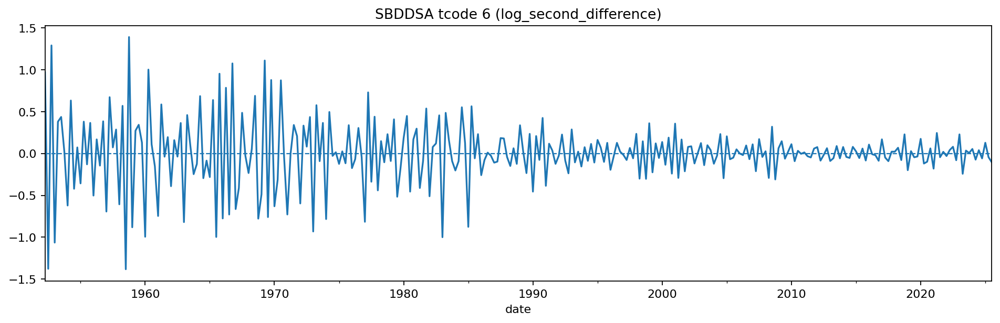 |
| SLGSDODNS | 
State and Local Governments; Debt Securities and Loans; Liability, Level - per sector of TCMDO Caveats: - t5 or t6 again (t5 with mean 0?) - same tcode for all per sector
 | 1945-10-01 -> 2025-07-01 | Quarterly, End of Period Seasonally Adjusted Annual Rate | n_missing=18; share=5.62%; intervals=1946-01-01->1946-07-01 (3), 1947-01-01->1947-07-01 (3), 1948-01-01->1948-07-01 (3), 1949-01-01->1949-07-01 (3), 1950-01-01->1950-07-01 (3); +1 more | 5 | 6 | 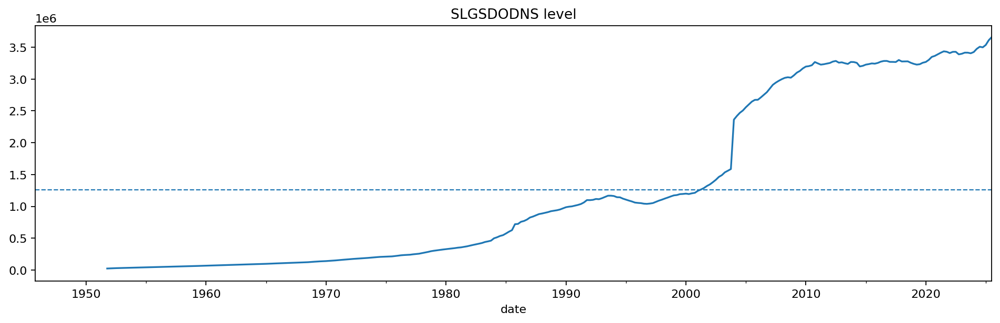 | 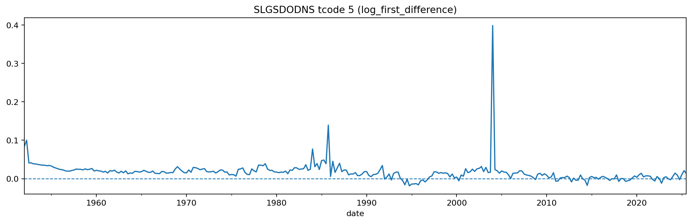 | 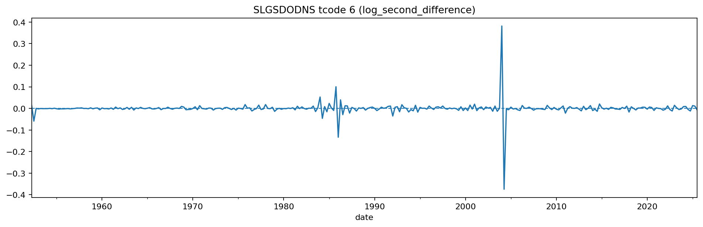 |
| TBSDODNS | 
Nonfinancial Business; Debt Securities and Loans; Liability, Level - per sector of TCMDO Caveats: - t5 or t6 again - same tcode for all per sector
 | 1945-10-01 -> 2025-07-01 | Quarterly, End of Period Seasonally Adjusted Annual Rate | n_missing=18; share=5.62%; intervals=1946-01-01->1946-07-01 (3), 1947-01-01->1947-07-01 (3), 1948-01-01->1948-07-01 (3), 1949-01-01->1949-07-01 (3), 1950-01-01->1950-07-01 (3); +1 more | 5 | 6 | 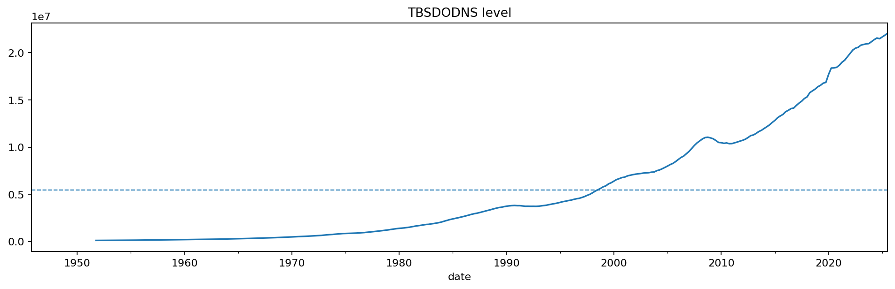 | 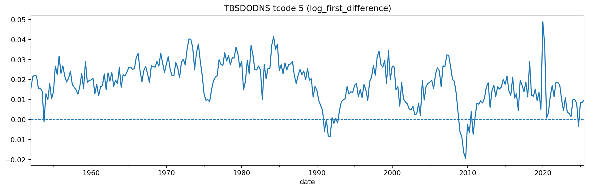 | 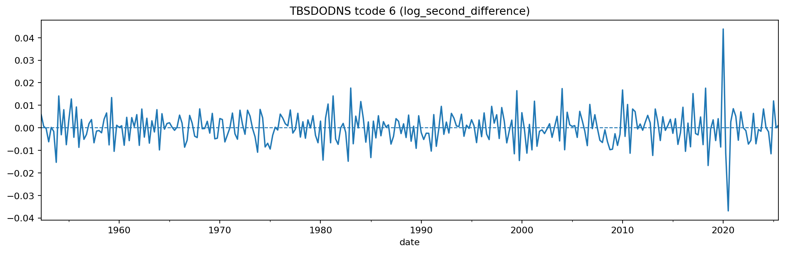 |
