# Analyzed Series - debt

This file is auto-managed by append_series_to_markdown_overview().

| Series_ID | Description | Interval Covered | Frequency | Missing Values Summary | Suggested TCode 1 | Suggested TCode 2 | Level Plot | TCode 1 Plot | TCode 2 Plot |
| --- | --- | --- | --- | --- | --- | --- | --- | --- | --- |
| FYPUGDA188S | 
Gross Federal Debt Held by the Public as Percent of Gross Domestic Product - same as GFDEGDQ188S but anually therefore longer horizon Caveats: - not sure about tcode, test suggest 6 but I think 2 is enough?
 | 1939-01-01 -> 2023-01-01 | Annual Not Seasonally Adjusted | n_missing=0; share=0.00%; intervals=none | 2 |  | 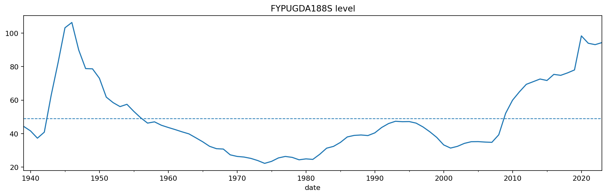 | 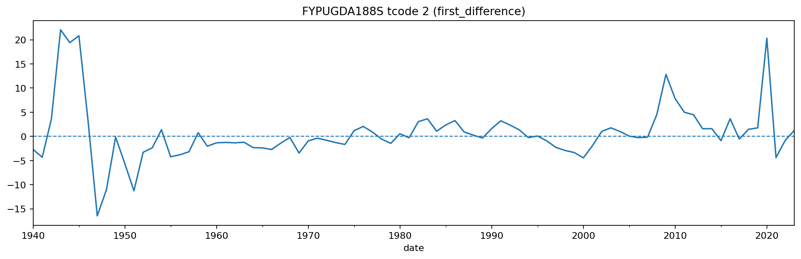 |  |
| GFDEBTN | 
Federal Debt: Total Public Debt, -  is a good measure of macro cycles Caveats: - raw debt - not sure about tcode, t5 witha  mean subtraction would be best I think - t6 seems very noisy
 | 1966-01-01 -> 2025-10-01 | Quarterly, End of Period Not Seasonally Adjusted | 
n_obs=240n_missing=0share_missing=0.00% intervals=none
 | 5 | 6 | 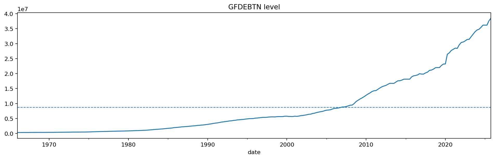 | 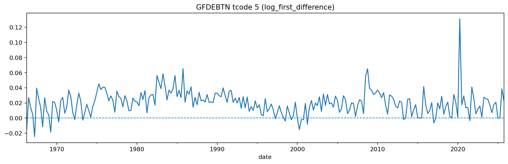 | 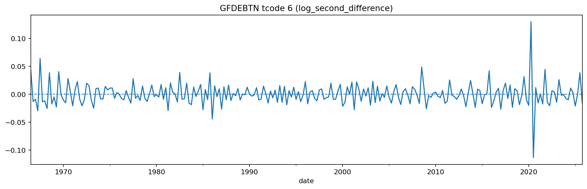 |
| GFDEGDQ188S | 
Federal Debt: Total Public Debt as Percent of Gross Domestic Product - basically same series as above but in comparison to gdp, probly better Caveats: - none, tcode should be good - maybe no homoscedastic
 | 1966-01-01 -> 2025-10-01 | Quarterly Seasonally Adjusted | 
n_obs=240n_missing=0share_missing=0.00% intervals=none
 | 2 |  | 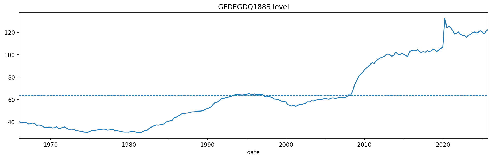 | 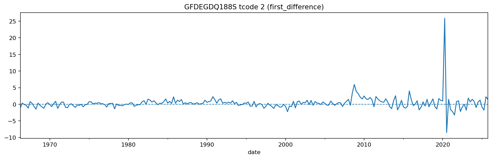 |  |
| MVGFD027MNFRBDAL | 
Market Value of Gross Federal Debt - good because monthly - same as GFDEBTN but market value, which is deemed more accurate Caveats: - again tcode 5 or 6, maybe t5 with mean 0
 | 1942-01-01 -> 2026-02-01 | Monthly Not Seasonally Adjusted | 
n_obs=1010n_missing=0share_missing=0.00% intervals=none
 | 5 | 6 | 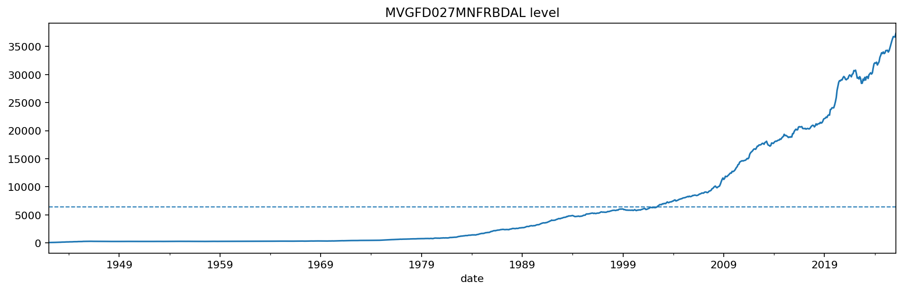 | 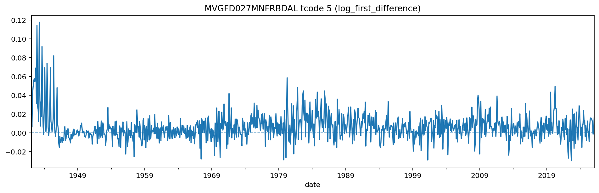 | 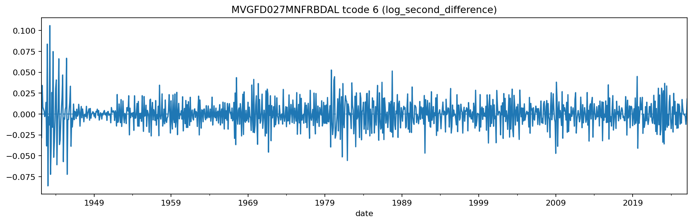 |
| TCMDO | 
All Sectors; Debt Securities and Loans; Liability, Level - basically same as GFDEBTN but liability level not debt Caveats: - again tcode between 5 and 6, 5 with mean 0 would be good - only yearly data in early series
 | 1945-10-01 -> 2025-07-01 | Quarterly, End of Period Not Seasonally Adjusted | 
n_obs=320n_missing=18share_missing=5.62% 1946-01-01 -> 1946-07-01 (3) 1947-01-01 -> 1947-07-01 (3) 1948-01-01 -> 1948-07-01 (3) 1949-01-01 -> 1949-07-01 (3) 1950-01-01 -> 1950-07-01 (3) 1951-01-01 -> 1951-07-01 (3)
 | 5 | 6 | 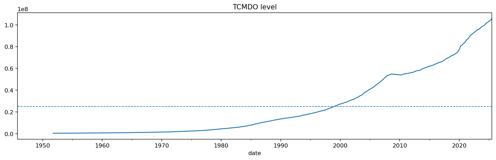 | 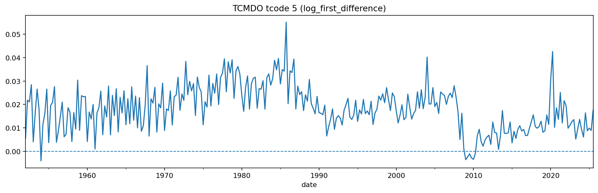 | 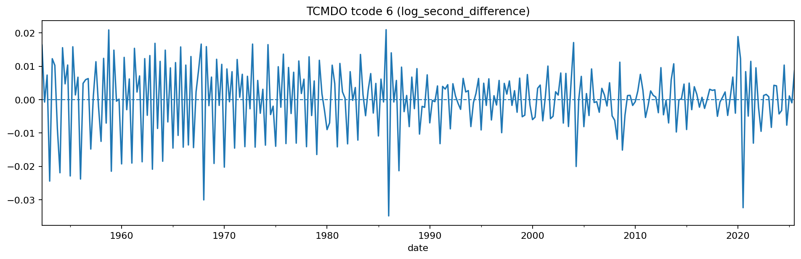 |
