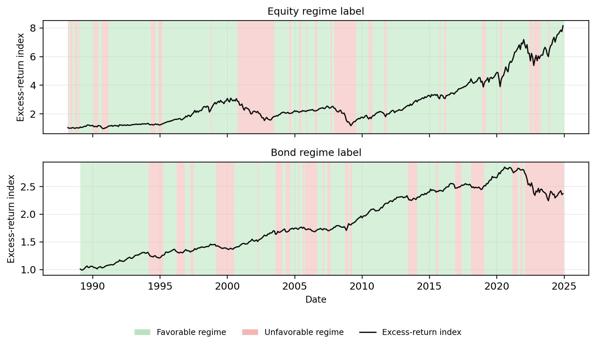
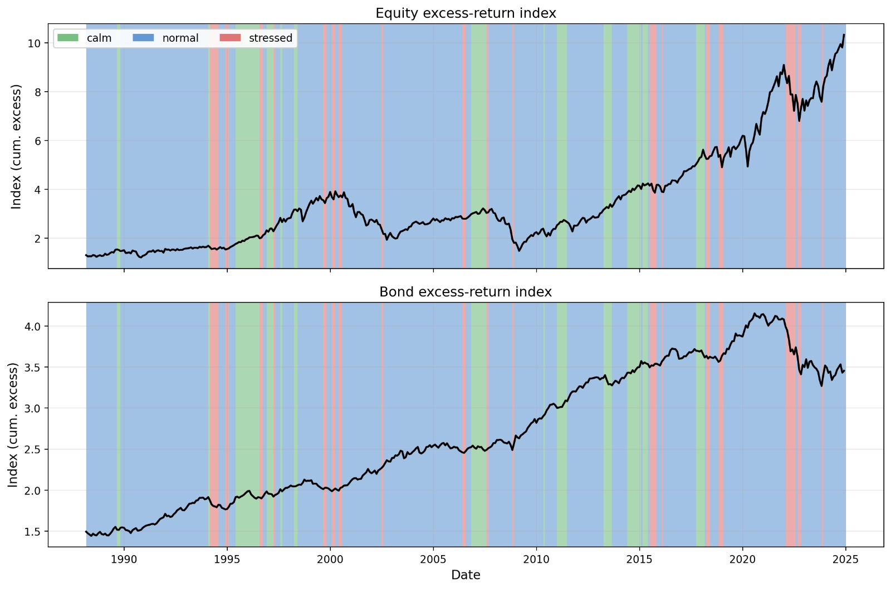
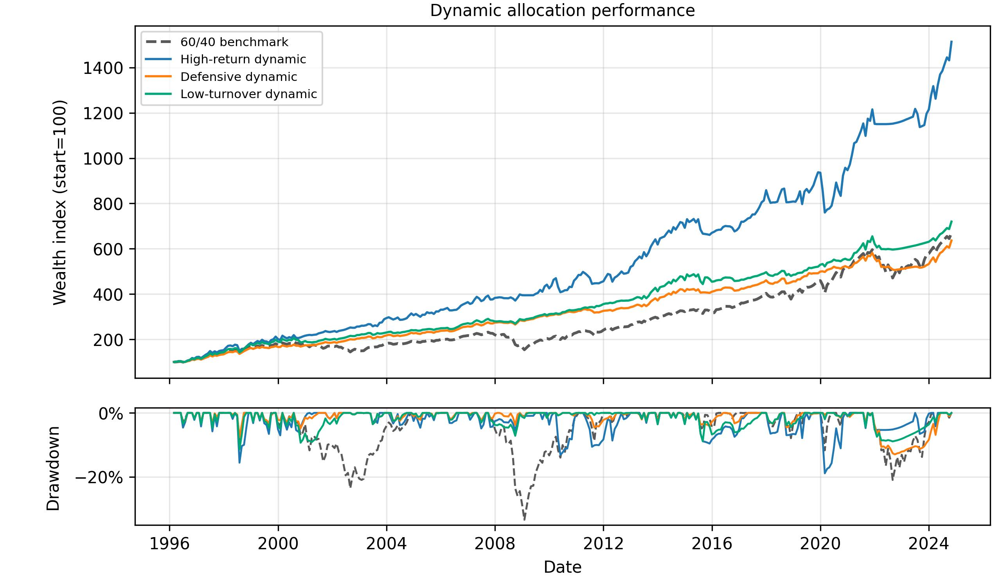
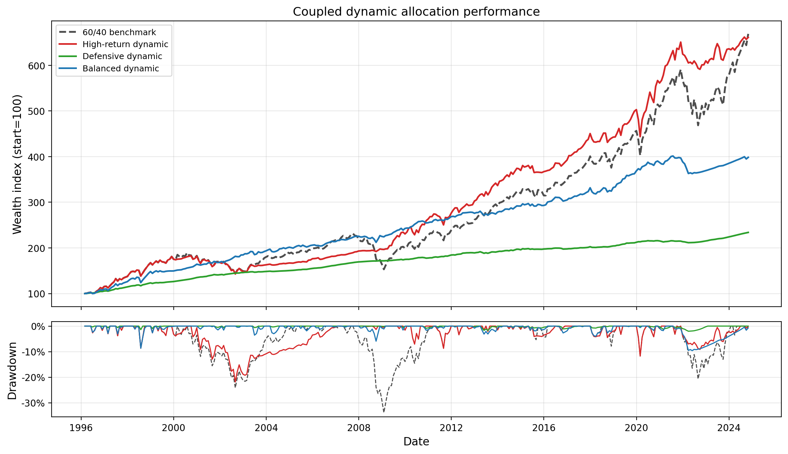
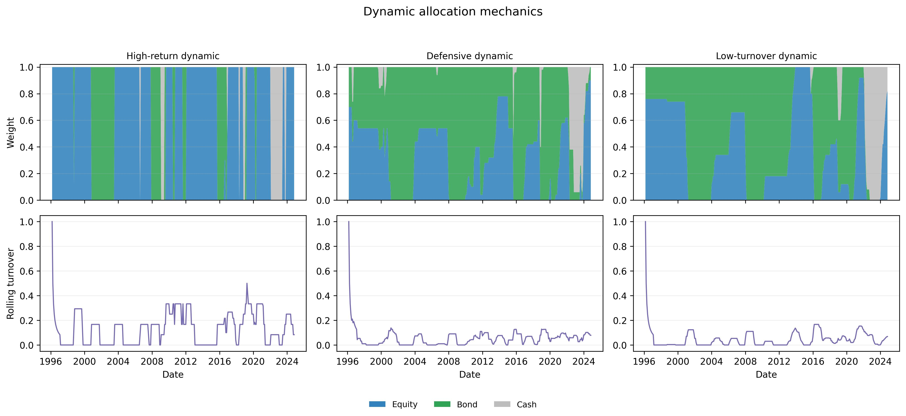
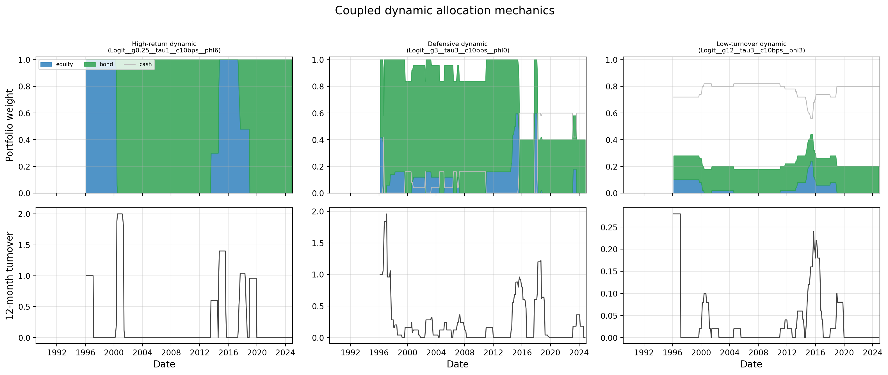

# Regime-Aware Tactical Asset Allocation

This project asks whether predicted equity and bond return regimes improve monthly allocation across equities, bonds, and cash after transaction costs. The motivation is the state-dependent stock--bond hedge: bond exposure can support equity drawdowns in disinflationary episodes, and the same bond exposure can lose value when inflation shocks pressure both legs. The empirical design estimates realised regimes, forecasts next-month regime probabilities, and tests whether those probabilities improve allocation relative to a monthly rebalanced 60/40 benchmark.

## Research question

A static stock--bond allocation depends on the bond leg diversifying equity risk. That relation changes across market environments. The dot-com bust and the global financial crisis are equity drawdowns with bond support. The 1994 bond shock and the 2022 inflation sell-off are episodes in which equity and bond losses coincide.

The empirical question is whether information available at the end of each month supports a tactical change in next-month equity, bond, and cash exposure. The out-of-sample test evaluates whether forecast probabilities improve portfolio choice after turnover and transaction costs.

## Empirical design

1. **Teacher labels**  
   Statistical jump models estimate realised regime labels from equity and bond return features. The labels are designed to be persistent enough for monthly allocation and economically separated across return states.

2. **Student forecasts**  
   Regularised logistic regression and random forests forecast next-month regime probabilities from lagged macro-financial predictors.

3. **Allocation**  
   Forecast probabilities are mapped into regime-conditional return moments and long-only equity, bond, and cash weights. Portfolio returns are evaluated net of one-way transaction costs against a 60/40 benchmark.

## Regime representations

- **Independent:** separate favourable and unfavourable regime labels for equity and bonds.
- **Coupled:** one joint stock--bond regime label with calm, normal, and stressed states.

The Independent representation gives asset-level exposure signals. The Coupled representation gives a direct signal for the joint diversification environment.

## Motivation from the regime labels

The first step is to check whether the realised labels describe economically different environments. The regime labels separate states with different return signs, Sharpe ratios, and stock--bond behaviour.





_The Independent label figure marks favourable equity and bond regimes separately. The Coupled label figure classifies the joint stock--bond environment into calm, normal, and stressed regimes._

### Label-conditional economics

| Representation | Asset | Regime | Share | Annualised return | Volatility | Sharpe | Economic role |
|---|---|---:|---:|---:|---:|---:|---|
| Independent | Equity | Favourable | 75.6% | +13.7% | 12.0% | +1.14 | Positive equity state |
| Independent | Equity | Unfavourable | 24.4% | -14.5% | 19.4% | -0.75 | Negative equity state |
| Independent | Bond | Favourable | 67.1% | +5.7% | 3.2% | +1.81 | Positive bond state |
| Independent | Bond | Unfavourable | 32.9% | -4.1% | 5.0% | -0.81 | Negative bond state |
| Coupled | Equity | Calm | 13.8% | +21.0% | 8.1% | +2.60 | Strongest equity state |
| Coupled | Equity | Normal | 77.1% | +9.9% | 14.8% | +0.67 | Equity risk with bond support |
| Coupled | Equity | Stressed | 9.0% | -40.9% | 13.7% | -2.99 | Joint stock--bond loss state |
| Coupled | Bond | Calm | 13.8% | +0.8% | 3.5% | +0.22 | Bond return in calm state |
| Coupled | Bond | Normal | 77.1% | +3.9% | 3.9% | +1.00 | Bond support in normal state |
| Coupled | Bond | Stressed | 9.0% | -8.4% | 5.0% | -1.69 | Bond loss in stressed state |

The key distinction is not only whether equity is weak. It is whether bonds remain a hedge when equity is weak. Normal coupled regimes describe equity weakness with bond support. Stressed coupled regimes describe a joint adverse state.

## Historical stress windows

The crisis-window evidence motivates the allocation problem. In disinflationary equity sell-offs, bonds remain useful. In inflation-led sell-offs, bonds can lose value together with equities.

| Window                  | Independent bond favourable share | Independent bond Sharpe | Coupled normal share | Coupled stressed share | Coupled bond Sharpe | Reading                           |
| ----------------------- | --------------------------------: | ----------------------: | -------------------: | ---------------------: | ------------------: | --------------------------------- |
| 1990 recession          |                            100.0% |                   +1.33 |                 100% |                     0% |               +1.41 | Bond support                      |
| 1994 bond shock         |                              8.3% |                   -1.55 |                  33% |                    58% |               -1.61 | Joint pressure                    |
| Dot-com bust            |                             87.5% |                   +1.81 |                  97% |                     3% |               +1.97 | Equity drawdown with bond support |
| Global financial crisis |                             72.2% |                   +0.74 |                  94% |                     6% |               +0.74 | Equity drawdown with bond support |
| Euro sovereign 2011     |                            100.0% |                   +3.46 |                  88% |                     0% |               +3.69 | Bond support                      |
| Covid crash             |                            100.0% |                   +2.25 |                 100% |                     0% |               +2.76 | Bond support                      |
| Inflation 2022          |                              0.0% |                   -1.82 |                  33% |                    67% |               -1.90 | Joint pressure                    |

## Forecasting the regimes

The student stage tests whether the realised teacher labels contain predictable structure from lagged macro-financial predictors. The Independent student forecasts favourable-state probabilities for equity and bonds. The Coupled student forecasts a probability vector over calm, normal, and stressed regimes.

| Representation | Target                   |               Model |   AUC | Balanced accuracy | Brier | Log loss |
| -------------- | ------------------------ | ------------------: | ----: | ----------------: | ----: | -------: |
| Independent    | Equity favourable state  | Logistic regression | 0.929 |             0.846 | 0.088 |    0.296 |
| Independent    | Equity favourable state  |       Random forest | 0.903 |             0.831 | 0.107 |    0.361 |
| Independent    | Bond favourable state    | Logistic regression | 0.892 |             0.831 | 0.128 |    0.462 |
| Independent    | Bond favourable state    |       Random forest | 0.873 |             0.800 | 0.147 |    0.471 |
| Coupled        | Calm / normal / stressed | Logistic regression | 0.770 |             0.677 | 0.541 |    1.062 |
| Coupled        | Calm / normal / stressed |       Random forest | 0.776 |             0.595 | 0.383 |    0.686 |

The forecast output used in allocation is the probability, not a hard class label. This matters because the allocation rule maps probabilities into conditional return moments and portfolio weights.

## Allocation results

The allocation stage is the economic test of the regime forecasts. The selected strategies are evaluated against a monthly rebalanced 60/40 benchmark using long-only equity, bond, and cash weights with 10 bps one-way transaction costs.





_The wealth and drawdown figures show when the selected dynamic allocations earn their performance relative to 60/40._

### Selected out-of-sample allocation results

| Representation | Role         | Strategy                              | Annualised excess return | Volatility | Sharpe | Max drawdown | Final wealth |
| -------------- | ------------ | ------------------------------------- | -----------------------: | ---------: | -----: | -----------: | -----------: |
| Independent    | Defensive    | Random forest, smoothed predictors    |                    +4.4% |       5.8% |   0.77 |       -14.9% |        341.9 |
| Independent    | Low-turnover | Logistic, z-score + smoothed z-score  |                    +5.0% |       7.2% |   0.69 |       -13.0% |        386.6 |
| Independent    | High-return  | Logistic, smoothed predictors         |                    +7.9% |      10.6% |   0.74 |       -19.3% |        814.2 |
| Independent    | Benchmark    | 60/40                                 |                    +4.5% |       9.6% |   0.47 |       -36.2% |        359.4 |
| Coupled        | Defensive    | Minimum variance, probability mixture |                   +0.80% |       1.2% |   0.64 |        -2.0% |        234.0 |
| Coupled        | Balanced     | Mean--variance, probability mixture   |                   +2.74% |       4.4% |   0.63 |        -9.6% |        398.5 |
| Coupled        | High-return  | Mean--variance, probability mixture   |                   +4.70% |       7.6% |   0.62 |       -21.9% |        661.2 |
| Coupled        | Benchmark    | 60/40                                 |                   +4.92% |       9.6% |   0.47 |       -33.9% |        668.9 |

The results are benchmark-relative trade-offs. Defensive allocations reduce drawdowns and raise Sharpe ratios. Low-turnover and balanced allocations keep part of the risk control with less aggressive rebalancing. High-return allocations keep larger risky exposure during favourable forecasted regimes.

## Portfolio-weight behaviour

The selected allocations differ in how forecast probabilities change equity, bond, and cash exposure.





_The allocation mechanics show how forecast probabilities translate into portfolio weights, turnover, wealth, and drawdown._

## Main findings

- Realised teacher labels separate economically distinct equity, bond, and joint stock--bond environments.
- Historical stress windows show why the bond hedge must be treated as state dependent.
- Student models produce informative out-of-sample forecast probabilities for next-month regimes.
- Dynamic allocations improve on 60/40 along different margins: drawdown control, Sharpe ratio, turnover, and terminal wealth.
- The regime information is most useful when it changes exposure in states where the static benchmark is least suited to the stock--bond environment.

## Full report

- [Full report PDF](Report/regime_aware_tactical_asset_allocation.pdf)
- [Compressed GitHub preview PDF](Report/regime_aware_tactical_asset_allocation_github_preview.pdf)

## Notebook

- [Full-output notebook](Regime-Aware%20Tactical%20Asset%20Allocation%20%28independant%29/notebooks/regime_aware_tactical_asset_allocation.ipynb)
- [GitHub preview notebook](Regime-Aware%20Tactical%20Asset%20Allocation%20%28independant%29/notebooks/regime_aware_tactical_asset_allocation_github_preview.ipynb)

Source files:

- Main article: `Report/regime_aware_tactical_asset_allocation.tex`
- Appendix: `Report/regime_aware_tactical_asset_allocation_appendix.tex`

## Repository layout


```text
Regime-Aware Tactical Asset Allocation/   Main notebook and project materials.
Report/                                   Final article source, appendix, figures, tables, and compiled PDF.
Method Development Archive/               Earlier method-development, baseline, and exploratory folders.
```
